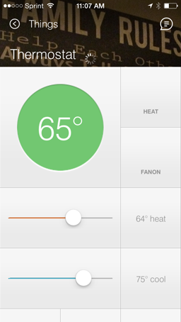
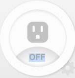
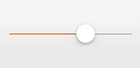
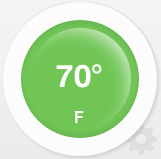

Anatomy of a Device Type
========================

Metadata Declarations
---------------------

| \*\* Definition Metadata\*\*
| The definition metadata defines the core attributes of your Device
Type. These previously were found in the web UI, but must now be defined
in the code itself. You need to pass along the name, namespace, and
author to the definition method, and then you can define relevant
capabilities, commands, attributes, and your fingerprinting information
in the closure.

For your namespace, you should use your GitHub Username. Internal apps
use the name space smartthings.

Capabilities are the interactions that a device allows. We have a
`reference
document <../introduction/what-can-developers-do-with-smartthings/device-type-development/capability-taxonomy.md>`__
that lists all available capabilities. When you define a capability, you
are stating that your device supports the given capability.

Commands are the actions to be taken on your device. When you define a
command, you are stating that your capabilities support a given command.

Attributes are the possible values for a particular command. When you
define an attribute, you are stating that your commands supports a given
attribute.

When you define capabilities, they have defined commands and attributes
that come along with them, so you don't need to include those commands
and attributes explicitly.

The fingerprinting process is dependent on the type of device you are
looking to pair. SmartThing attempts to match devices coming in
depending on the input and output clusters a device uses, as well as a
profileId (for ZigBee) or deviceId (for ZWave). Basically, by
determining what capabilities your device has, SmartThings determines
what your device is.

For ZigBee devices, the main profileIds you will need to use are

-  HA: Home Automation (0104)
-  SEP: Smart Energy Profile
-  ZLL: ZigBee Light Lock (C05E)

The input and output clusters are defined specifically by your device
and should be available via the device's documentation.

::

     definition (name: "Zigbee Hue Bulb", namespace: "smartthings", author: "SmartThings") {
        capability "Switch Level"
        capability "Switch"
        capability "Refresh"
        capability "Polling"
        capability "Color Control"
        capability "Sensor"
        capability "Configuration"
        capability "Actuator"

        command "setAdjustedColor"

        fingerprint profileId: "C05E", inClusters: "0000,0003,0004,0005,0006,0008,0300,1000", outClusters: "0019"

| **Simulator Metadata**
| Simulator Metadata is used when testing your device in the IDE
simulator. If you have examples of messages the device sends, you can
set it up to send those from the drop-down to your parse function to try
it out without needing to connect to the real device. You can also add
response messages that the device is expected to send in response to
what your commands send, to see your commands in action. They are built
using the following format: Device Command: Protocol-Specific Command
Message

::

    simulator {
        // status messages
        status "on": "on/off: 1"
        status "off": "on/off: 0"

        // reply messages
        reply "zcl on-off on": "on/off: 1"
        reply "zcl on-off off": "on/off: 0"
    }

| **UX Metadata**
| When creating a device type, you need to define how it will show up
for the end user on their "Things" screen. There are a variety of
customizations you can make within the framework, including colors and
tile widths.

| **Tile Definitions**
| There are three types of tiles that you can use within your device
types, and they all have specific parameters and a specific end user
view.

-  | standardTile()
   | Used for showing different labels and icons based on current state,
   for example to show a switch as on or off. You can view the `icon
   options here <http://scripts.3dgo.net/smartthings/icons/>`__.
   | |Standard Tile|

-  | controlTile()
   | Used for displaying or inputing a number within a range, for
   example to dim a light.
   | |Control Tile|

-  | valueTile()
   | Used for setting a particular value to be shown, for example to
   show degrees. |Value Tile|

Here's an example of using metadata to create the user experience for a
thermostat application.

::

    tiles {
        valueTile("temperature", "device.temperature", width: 2, height: 2) {
            state("temperature", label:'${currentValue}°',
                backgroundColors:[
                    [value: 31, color: "#153591"],
                    [value: 44, color: "#1e9cbb"],
                    [value: 59, color: "#90d2a7"],
                    [value: 74, color: "#44b621"],
                    [value: 84, color: "#f1d801"],
                    [value: 95, color: "#d04e00"],
                    [value: 96, color: "#bc2323"]
                ]
            )
    }
        standardTile("mode", "device.thermostatMode", inactiveLabel: false, decoration: "flat") {
            state "off", label:'${name}', action:"switchMode"
            state "heat", label:'${name}', action:"switchMode"
            state "emergencryHeat", label:'${name}', action:"switchMode"
            state "cool", label:'${name}', action:"switchMode"
            state "auto", label:'${name}', action:"switchMode"
        }
        standardTile("fanMode", "device.thermostatFanMode", inactiveLabel: false, decoration: "flat") {
            state "fanAuto", label:'${name}', action:"switchFanMode"
            state "fanOn", label:'${name}', action:"switchFanMode"
            state "fanCirculate", label:'${name}', action:"switchFanMode"
        }
        controlTile("heatSliderControl", "device.heatingSetpoint", "slider", height: 1, width: 2, inactiveLabel: false) {
            state "setHeatingSetpoint", action:"thermostat.setHeatingSetpoint", backgroundColor:"#d04e00"
        }
        valueTile("heatingSetpoint", "device.heatingSetpoint", inactiveLabel: false, decoration: "flat") {
            state "heat", label:'${currentValue}° heat', backgroundColor:"#ffffff"
        }
        controlTile("coolSliderControl", "device.coolingSetpoint", "slider", height: 1, width: 2, inactiveLabel: false) {
            state "setCoolingSetpoint", action:"thermostat.setCoolingSetpoint", backgroundColor: "#1e9cbb"
        }
        valueTile("coolingSetpoint", "device.coolingSetpoint", inactiveLabel: false, decoration: "flat") {
            state "cool", label:'${currentValue}° cool', backgroundColor:"#ffffff"
        }
        main "temperature"
        details(["temperature", "mode", "fanMode", "heatSliderControl", "heatingSetpoint", "coolSliderControl", "coolingSetpoint"])
    }

This builds the following interface:

   Thermostat
| **Tile Layouts**
| When working with the user experience, you'll quickly notice that the
UI is built on a grid with three columns and an unlimited height. When
you create your device types, you can determine how many grid columns
and rows you'd like a particular tile to take up. The default setting is
to have a tile take up a 1x1 block. Example:

::

    valueTile("temperature", "device.temperature", width: 2, height: 2) {

This particular tile takes up a 2x2 block.

It's also important to note that whatever is defined as **main** will be
the default tiles that can be selected on location and group displays.

::

    main "temperature"

**Details** is all tiles that will appear once you tap on a device and
view it's details. The tiles are listed in order.

::

     details(["temperature", "mode", "fanMode", "heatSliderControl", "heatingSetpoint", "coolSliderControl", "coolingSetpoint"])

| **Device Preferences**
| When you add a device, in addition to the "name your device" field you
could show other fields, and they'll be editable by tapping the
"preferences" tile in the device details. This is a fairly uncommon
scenario, but would be handled by the following code. You can find out
more about preferences
`here <../smartapp-developers-guide/preferences-&-settings.md>`__.

::

    preferences {
        input "sampleInput", "number", title: "Sample Input Title", description: "This is the sample input.", defaultValue: 20, required: false, displayDuringSetup: true
    }

Parse Method
------------

The parse method takes incoming device messages and generates changes
within SmartThings based on them. It's purpose is to map the events on a
device to events or change attributes within the SmartThings
architecture. The specifics by which the messages are converted is
dependent on the interface being used (ZigBee, Z-Wave, etc).

::

    def parse(String description) {
        def value = zigbee.parse(description)?.text
        def name = value && value != "ping" ? "response" : null
        def result = createEvent(name: name, value: value)
        log.debug "Parse returned ${result?.descriptionText}"
        return result
    }

Within this parse method, we return the response from createEvent, which
takes in a name value pair and returns a SmartThings event.

You can also use sendEvent() to send events outside of the
parse method.

Command Methods
---------------

When you create a device type, you must create a method for each
possible command. For example, for a device with the switch capability,
you'd need to have an off() and on() command method defined.
Additionally, you might have a poll() command method defined, if your
device had polling capability. Within these methods you convert the
abstracted command, to a device specific command to pass to the device.

::

    def on() {
        delayBetween([
            zwave.basicV1.basicSet(value: 0xFF).format(),
            zwave.switchBinaryV1.switchBinaryGet().format()
        ])
    }

    def off() {
        delayBetween([
            zwave.basicV1.basicSet(value: 0x00).format(),
            zwave.switchBinaryV1.switchBinaryGet().format()
        ])
    }

    def poll() {
        zwave.switchBinaryV1.switchBinaryGet().format()
    }

Note that you will also need to implement any custom commands as
individual methods.

