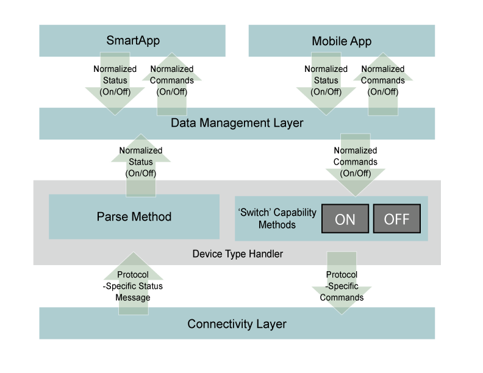

Device Type Overview
====================

The “things” that are integrated with the SmartThings platform are
generally referred to as “devices”. And devices are of a specific
“device type”. A device type can be generic (e.g. a thermostat) or it
can manufacturer and even model specific (e.g. a Honeywell Thermostat).

If SmartApps were all written to be able to use only specific
Manufacturer and model-specific device types, our application catalog
would be really big because we would have to replicate the applications
over and over again for each new device type.

The SmartThings architecture provides a unique abstraction of devices
from their distinct capabilities and attributes in a way that allows
developers to build applications that are insulated from the specifics
of which device they are using. For example, there are lots of
wirelessly controllable “switches”. A switch is any device that can be
turned On or Off. Switches can come in the form of pluggable outlet
overlays, in-wall outlets, in-wall light switches, etc.

When a SmartApp interacts with the virtual representation of a device,
it knows that the device supports certain actions based on its
capabilities. A device that has the ‘switch’ capability must support
both the ‘on’ and ‘off’ actions. In this way, all switches are the same,
and it doesn’t matter to the SmartApp what kind of switch is actually
involved. This layer of abstraction is key to the successful function
and flexibility of the SmartThings platform, and is made possible by a
concept called ‘device-type handlers’. Architecturally, device-type
handlers are the bridge between generic capabilities and the device or
protocol specific interface actually used to communicate with the
device.

The diagram below depicts where device-type handlers sit in the
SmartThings architecture.

   Smart Things Architecture
In the example shown above, the job of the device-type handler (that is
implementing the ‘switch’ capability) is to parse incoming,
protocol-specific status messages from the device and turn them into
normalized ‘events’. It is also responsible for accepting normalized
commands (such as ‘on’ and ‘off’) and turning those into the
protocol-specific commands that can be sent to the device to affect the
desired action.

For example, for a Z-Wave compatible on-off switch, the incoming status
messages used by the device to report an ‘on’ or ‘off’ state are as
shown below:

==============	=================================
Device Command	Protocol-Specific Command Message
==============	=================================
on				command: 2003, payload: FF
off				command: 2003, payload: 00
==============	=================================

Whereas the device status reported to the data management layer for the
device is literally just a simple ‘on’ or ‘off’.

Similarly, when a SmartApp or the mobile app invoked an ‘On’ or ‘Off’
command for a switch device, the command that is sent to the device-type
handler is just that simple: ‘On’ or ‘Off’. The device-type handler must
turn that simple command into a protocol-specific message that can be
sent down to the device to affect the desired action.

The table below shows the actual Z-Wave commands that are sent down to a
Z-Wave switch by the device-type handler.

==============	=================================
Device Command	Protocol-Specific Command Message

On				2001FF
Off				200100
==============	=================================

While the function of the device-type handlers is important, where they
execute is similarly important. Just like SmartApps, device-type
handlers are capable of executing in the SmartThings Cloud, or they can
be distributed to the SmartThings Hub in order to run locally and as
close to the actual device as possible. In fact, in order for SmartApp
event handlers to run locally, the Device-type Handler must also run
locally. Thus, the complexity of automatically determining the
deployment configuration for a specific set of devices and applications
is increased.

Writing Device-Type Handlers
----------------------------

Any SmartThings developer can write a device-type handler in order to
integrate a new device type. The broad definition of a new device type,
including the device-type handler itself, is comprised of the following:

-  Definition of the Device-Type Handler including namespace
-  Join/Pairing “Finger Prints” that allow us to type the device on join
-  Definitions of Capabilities & Attributes of the device type
-  Code that implements the Capabilities (as Commands) of the device
   type by Formatting Messages that are sent to the device (through our
   hub in most cases)
-  Definition of the Allowed Device States and their representation in
   the Mobile App

Code that manages state for the device type by Parsing the incoming
message from the device and updating state and attributes of the device

-  Definition of the Mobile App Device Detail Page Layout and Controls
-  Definition of template messages for the simulator
-  The device-type handler integrates into the overall SmartThings
   architecture in a way that allows it to essentially be the ‘plug-in’
   that normalizes the device and exposes its capabilities to the
   SmartThings platform.