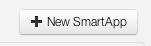
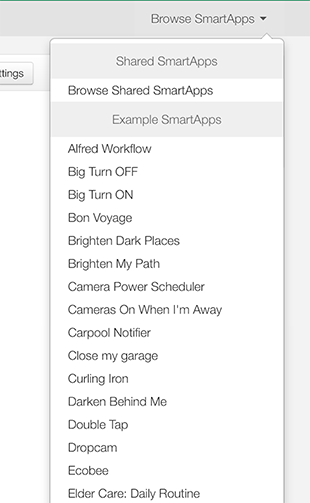
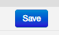
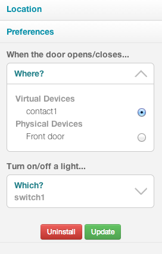
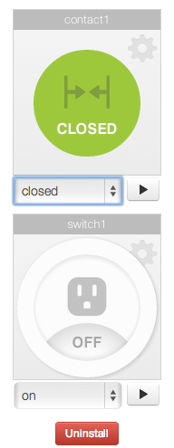
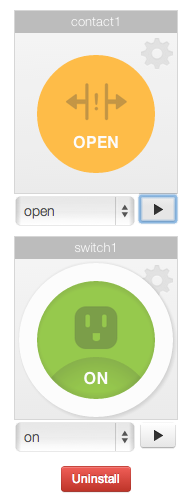

Building Your First SmartApp
============================

SmartApp Capabilities
---------------------

What can SmartApps actually do? SmartApps have the following
capabilities at this time:

-  Define Preferences that are used by our mobile (iOS, Android, future)
   applications in order to collect information needed to install the
   application
-  Subscribe (and Unsubscribe) to Events associated with Things (e.g.
   contactSensorOpen), People, and Locations
-  Set Timers and Alarms to Allow for Periodic Processing
-  Handle/Process Events
-  Define and Raise Custom Events
-  Issue Commands or Set Attributes on Things (e.g. Turn light on)
-  Send Notifications to Users
-  Access People and Presence Information
-  Access Location, Group, and Device information
-  Access Location Mode Information
-  Initiate a Change in Location Mode(s)
-  Consume External Web Services
-  Expose Externally Accessible Web Services
-  Persist information in Application State storage that is available
   across instantiations of the application
-  Log debug and trace information for diagnosing problems

SmartApp Fundamentals
---------------------

The basics of writing a SmartApp come down to just three things:

-  Setting preferences to gain access to devices
-  Subscribing to events and writing event handlers
-  Controlling devices and accessing information about devices

Front End Setup
---------------

The easiest way to create your first SmartApp is to copy one that is
already working and modify it. Thankfully, the IDE provides access to
lots of examples so that you can do exactly that.

To clone an existing SmartApp, just follow the steps below.

Navigate to the “My SmartApps” in the menu.

Click “+ New SmartApp” on the right side of the screen

   New SmartApp
Fill in the required fields in the application properties form.

.. figure:: ../../img/smartapps/required-fields.png
   :alt: Required Fields

   Required Fields
Push “Create” and you will see the skeleton app in the editor. Now
select from the “Browse SmartApps” menu near the top-right of the
screen. Choose the Let There Be Light! SmartApp as a starting point.

   Browse SmartApps
Finally, confirm that you want to overwrite the skeleton app with the
example app you just selected.

Now you have a functional application in the IDE that you can play with!
Be sure to push “Save” now to save the code, and you are ready to run
the app in the simulator.

   Save Button
SmartApp Preferences
--------------------

As a SmartApp developer, you need to be able to write generalized
applications that end-users will install from our application catalog.
But this is different than your typical iPhone or Android mobile
application, because SmartApps work with Things. And that means that the
SmartApps that you write need a way to know what Things they should be
working with.

That is where preferences come in - you will define preferences that
tell us what kind of Things and other information you need in order for
the application to be able to run. We’ll then use that preferences
meta-data to collect that information from the end-user at the time of
installation for the SmartApp.

Let’s look at our example's preferences:

::

    preferences
    {
        section("When the door opens/closes...") {
            input "contact1", "capability.contactSensor"
        }
        section("Turn on/off a light...") {
            input "switch1", "capability.switch"
        }
    }

This preferences definition will ask the user for two bits of
information: a device with a contact sensor capability to use and a
device with an on-off switch capability to use. Note that we are asking
for devices by capability and NOT by type. This is important since
device types are always protocol specific and may even be manufacturer
or model specific. If we want to write the most flexible SmartApp, we
need to forget about device types and embrace device capabilities.

The preferences meta-data defined in the application itself provides all
of the information we need to render and collect these preferences from
the end-user at the time they install (and configure) the application.
Users can change their preferences later as well, and applications need
to know how to react to those changes. Notice also that the preferences
gave internal (app-specific) names to the Things that are used by the
application (e.g. contact1 for the contact sensor and switch1 for the
on-off switch).

As a developer, you don’t know or care what the end-user called their
devices. You get to name them within the scope of your application so
that you can use those names whenever you reference the device.

Now that we have a basic understanding of preferences, lets look at
event handlers and event subscriptions and see how they work.

SmartApp Event Handlers
-----------------------

The SmartThings Cloud is all about events. Gazillions of them flowing
through our Cloud all the time. This switch turned on, temperature went
up, yada yada yada. But as a SmartApps developer you don’t get all the
events. You get the events that you subscribe to, and you can only
subscribe to events for devices that you are allowed to see (more about
security later).

You can subscribe and unsubscribe to events as you see fit in your
application, but there are two specific places where this will almost
always make sense. Those places are the “Installed” and the “Updated”
event handlers.

The “Installed” and “Updated” event handlers are places where you can
write code that is invoked when an application is installed or when the
preferences (settings) are updated. Get use to writing these two default
event handlers because you will ALWAYS need them.

Here is an example of both an “Installed” and “Updated” event handler:

::

    def installed()
    {
        subscribe(contact1,"contact",contactHandler)
    }

    def updated()
    {
        unsubscribe()
        subscribe(contact1,"contact",contactHandler)
    }

You can see in the example above, that the “installed” event handler is
subscribing to all "contact" events for the contact sensor device
“contact1”. And then in the “updated” event handler, it is unsubscribing
to all events, and then re-subscribing again to all "contact" events for
the device “contact1”. That’s because the user preferences might have
changed what device “contact1” is pointing to - so the app needs to
re-establish the subscription.

In this example, the subscription is for the specific class or type of
event called “contact”. The reference to contact1,"contact" refers to
all ‘contact’ events from that device. If the device supported other
events, such as ‘motion’, you would see contact1,"motion” as well.

When a contact event is triggered on contact1, it will call the
contactHandler method.

Executing Device Commands
-------------------------

The rubber meets the road in the event handlers because this is where
you will actually take actions on the devices that your SmartApp has
access to.

We discussed capabilities above and how they imply a collection of both
Actions and Attributes that are supported by the device, and that are
accessible to the SmartApp developer. In the example app that we’ve been
looking at, we requested a device with ‘switch’ capability. That means
that the device provided at runtime will support both ‘On’ and ‘Off’
actions.

So lets look at how we actually invoke those actions:

::

    def contactHandler(evt) {
        log.debug "$evt.value"
        if (evt.value == "open") {
            switch1.on()
        } else if (evt.value == "closed") {
            switch1.off()
        }
    }

When this handler method gets called, it determines whether the door is
open or closed and invokes the proper command on the switch1 device.

Testing using the Simulator
---------------------------

Launch the application in the simulator by first setting the location.
From here you will see your preferences settings. You can select either
virtual devices, or real physical device that you have connected to
SmartThings.

   Save Button
Click on Update to run your application. You can simulate changing a
devices state using the dropdowns below the icons. For example, by
changing contact1 to open, you should see switch1 change to on.

|Save Button| |Save Button|

Once you see the SmartApp working in the simulator - try changing it and
running it again! Congrats! You now know how to build SmartApps!

