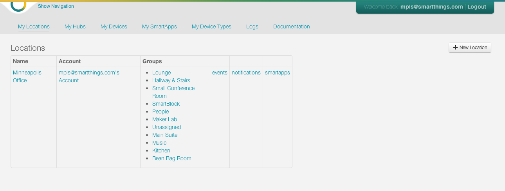
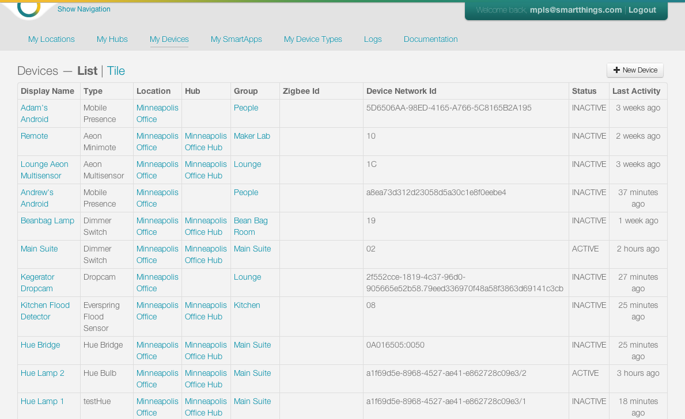
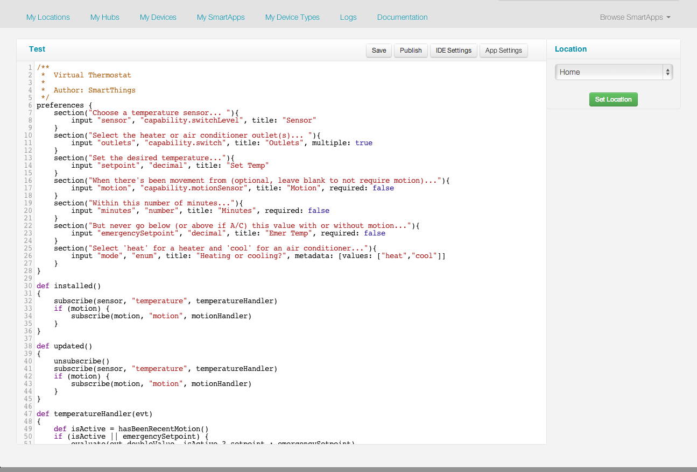
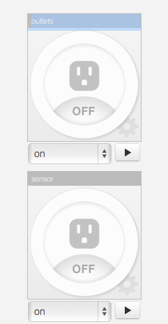
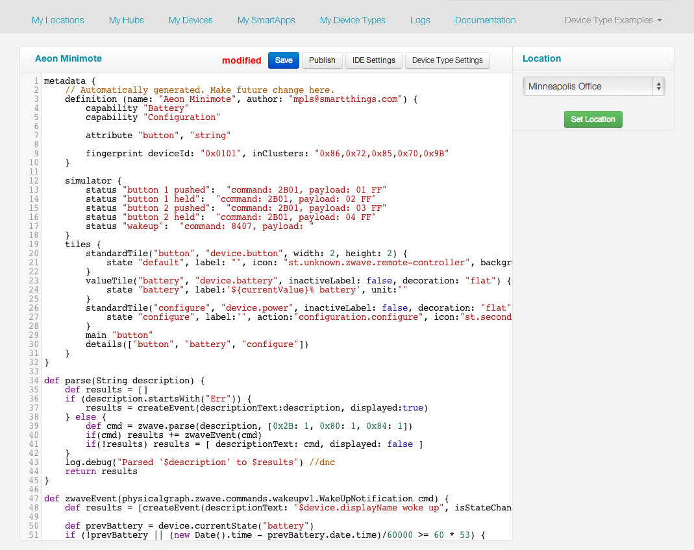
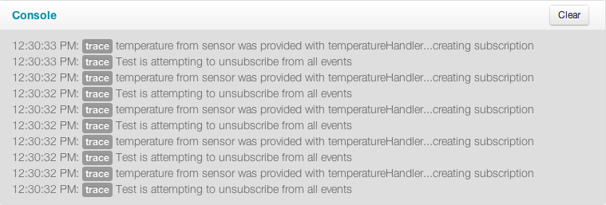

What is the IDE?
================

An IDE (Integrated Development Environment) is a set of tools that
allows you to develop software for a particular domain or purpose.

SmartThings has provided a comprehensive platform for you to build
applications for our ecosystem.

The web-based IDE provides the following capabilities to SmartThings
developers:

-  SmartApp Development
-  Device-Type Handler Development
-  A built-in simulator to test SmartApps and Device-Type Handlers
-  Management of Locations, Hubs, Groups, and Devices

Account & Device Management Tools
---------------------------------

You can access all aspects of your locations, hubs and devices within
the IDE.

   My Locations
My Locations will show all locations registered to your account.
Choosing a particular location will allow you to see more in depth
information on that location, including the groups created under that
location. You can also see all events, notifications, and SmartApps
under a particular location.

.. figure:: ../../img/ide/hub-list.png
   :alt: My Hubs

   My Hubs
My Hubs will show all hubs registered to your account. Choosing a
particular hub will give a comprehensive look at all of the attributes
of your hub, with the opportunity to observe all events that have taken
place, by clicking on "List Events". You can also view all of the
devices that are registered to your hub.

   My Devices
My Devices will show all devices attached to any of your hubs. Choosing
a particular device will give a comprehensive look at all of the
attributes of your device, with the opportunity to observe all events
that have taken place, by clicking on "List Events".

SmartApp Editor & Simulator
---------------------------

You will create your SmartApps directly on the web using the SmartApp
editor. You will be able to either create one from scratch, or build one
based on another published SmartApp.

   Ide
We have plenty of tutorials and examples to help you get starting in
building your custom SmartApps.

The next step after coding your SmartApp is to test it using virtual
devices in the IDE simulator. When you run your application in the IDE,
it is always running in the simulation framework. The IDE simulator does
two very important things to support simulation:

-  It acts as a “Virtual Hub” that has virtual devices connected to it
-  It acts as if it was the SmartThings Mobile application to receive
   and process status updates and support direct user actions on devices
   through a simulated mobile app control

Further, the IDE simulation environment allows you to run the simulator
attached to any of the “Locations” defined within your account.

   Simulator
Once you have tested your SmartApp using virtual devices, the next step
is to test it using real devices. If you don’t have real physical
devices of the correct type or capability to test with, you can even
test with a combination of real physical and virtual devices. That means
that you can actually build SmartApps for devices that you don’t even
have.

Device Type Handler Development
-------------------------------

   Device Type IDE
You will also create your Device Type handlers directly on the web using
the editor tools. These are developed very similarly to our SmartApps,
and can be run and tested on the web.

Log Console
-----------

At the moment we don’t yet support a debugger environment that allows
you step through your code one statement at a time in order to debug it.
We do allow you to add logging statements to your code that will appear
in the IDE console log so that you can debug your code that way.

   Console
