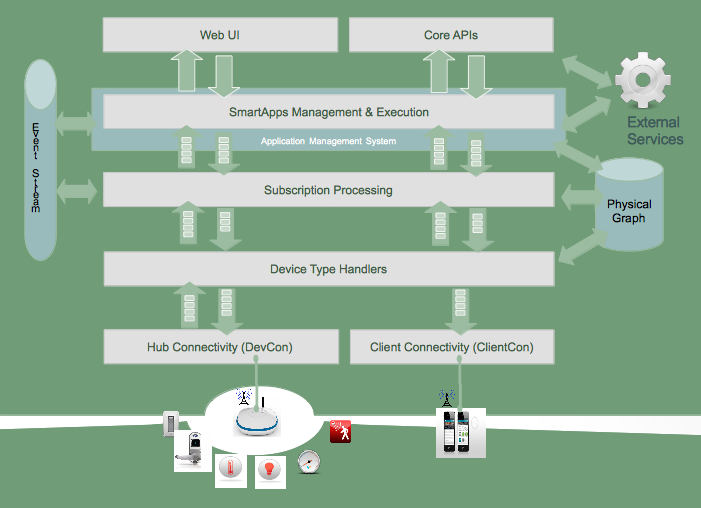

SmartThings Architecture
=========================

.. TODO: I think we need a nicer looking picture. (Jesse O'Neill-Oine)
|Container Hierarchy|

Devices
-------

Devices are the building blocks of the SmartThings infrastructure. They
are the connection between the SmartThings system and the physical
world. There's a huge variety in the devices you can use, some created
by SmartThings but most not.

| **SmartThings Devices**
| SmartThings manufactures a variety of devices for you to use with your
SmartThings hub. Your initial kit comes with a few devices such as the
`SmartSense
Multi <https://shop.smartthings.com/#/products/smartsense-multi>`__
which reports motion, temperature, and a variety of other sensory
updates. SmartThings also manufactures and sells the `SmartSense Motion
Sensor <https://shop.smartthings.com/#/products/smartsense-motion>`__,
`SmartSense Presence
Sensor <https://shop.smartthings.com/#/products/smartsense-presence>`__,
`SmartSense Moisture
Sensor <https://shop.smartthings.com/#/products/smartsense-moisture>`__,
and `SmartPower
Outlets <https://shop.smartthings.com/#/products/smartpower-outlets-3-pack>`__.

| **Third Party Devices**
| The real power of SmartThings is that our system works with most home
automation devices already on the market. We believe in a fully
integrated approach, where you aren't tied into a particular technology
or protocol. We offer compatibility with standards such as Zigbee,
ZWave, and IP/WiFi, so we work with literally hundreds of off the shelf
third-party devices. There is `an outlet made by
GE <https://shop.smartthings.com/#/products/ge-z-wave-wireless-lighting-control-lamp-module-dimmer>`__
that allows you to integrate with your SmartThings system to dim your
lights. There are
`sirens <https://shop.smartthings.com/#/products/fortrezz-siren-strobe-alarm>`__
for notifying you of happenings in the SmartThings system. We even have
solutions for things like `locking your
doors <https://shop.smartthings.com/#/bundles/solution-i-can-lock-and-unlock-my-doors-from-anywhere>`__.

Hub
---

The SmartThings Hub connects directly to your broadband router and
provides communication between all connected Things and the SmartThings
cloud and mobile application.

-  Connects any SmartThings or SmartThings Ready device to your
   SmartThings account.
-  Simply plug into your Ethernet router and provide power.
-  Build your own SmartThings kit by combining with other SmartThings
   devices.
-  Also works with standard ZigBee and ZWave devices, such as GE ZWave
   in-wall switches and outlets.

Connectivity Management
-----------------------

Connectivity Management is the layer that connects your SmartThings hub
and client devices (mobile phones) to our servers, and the cloud as a
whole. We have two parts of this layer currently:

-  Hub Connectivity connects your hub to the cloud.
-  Client Connectivity connects your client devices to the cloud.

These are the highways by which your messages are sent to the internet.

Device-Type Execution
---------------------

The SmartThings system determines what device type you are using based
on device type handlers. Once the device type handler is selected, the
incoming messages are parsed by that particular device type. The input
of the device type handler are device specific messages, and the output
is normalized SmartThings events. Note that one message can lead to many
SmartThings events.

Subscription Management
-----------------------

When events are created in the SmartThings platform, they don't
inherently do anything besides publish that they've happened. Instead of
events triggering change, SmartApps are configured with subscriptions
that listen for defined events. The purpose of the subscription
management layer is to match up events that are triggered by the device
type handlers with which SmartApp is using them.

SmartApp Execution
------------------

The SmartApp is run when trigged via subscriptions, external calls to
SmartApp endpoints, or scheduled methods. It's transient in nature, as
it runs and then stops running on completion of its task. Any data that
needs to persist throughout SmartApp instances must be stored in state.

Core APIs
---------

SmartThings provides APIs that can be used both internally and
externally to power experiences around our platform. The APIs drive the
data behind our user experiences.

The Core API drives the interactions between our mobile applications and
SmartThings. Please contact us if you are interested in utilizing the
Core API to build custom solutions.

SmartThings also has an Event Streaming API that allows us to keep up
with events from devices as they are being utilized in real time.

Web-UI & IDE
------------

The Web-UI sits on top of all of the other technology and allows you to
monitor your devices, hubs, locations and many other aspects of your
SmartThings system.

You have full control of the configuration, including editing, adding,
removing, and even creating SmartApps. To create, you can write code
within the IDE for SmartApps and Device Types. We also have an
integrated simulator that allows you to simulate any devices, so it's
not required to own the devices you develop for.

