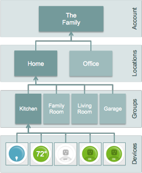

Smart Things Important Concepts
===============================

Within the SmartThings platform, there are three different “containers”
that are important concepts to understand. These are: accounts,
locations, and groups. These containers represent both security
boundaries and navigation containers that make it easy for users to
browse their devices.

The diagram below shows the hierarchical relationship between these
containers. Each type of container is described below in more detail.

   Container Hierarchy
Accounts
--------

Accounts are the top-level container that represents the SmartThings
‘customer’. Accounts contain only Locations and no other types of
objects.

Locations & Users
-----------------

Locations are meant to represent a geo-location such as “Home” or
“Office”. Locations can optionally be tagged with a geo-location
(lat/long). In addition, Locations don’t have to have a SmartThings Hub,
but generally do. Finally, locations contain Groups or Devices.

Groups
------

Groups are meant to represent a room or other physical space within a
location. This allows for devices to be organized into groups making
navigation and security easier. A group can contain multiple devices,
but devices can only be in a single group. Further, nesting of groups is
not currently supported.

Hubs
----

The SmartThings Ethernet Hub connects directly to your broadband router
and provides communication between all connected Things and the
SmartThings cloud and mobile application.

Devices
-------

Devices are the bones of the physical graph; they are motion sensors,
locks, thermostats, and everything else in between. They are the
connectors between the physical and digital world.

Device-Types
------------

A device type can be as broad as the category it falls under (such as
switches) or as specific as the device itself (such as a WeMo switch).

Device-Type Handlers
--------------------

Device Type Handlers are the glue; the code between the device type and
our SmartThings infrastructure. It allows us to abstract devices by
their capabilities, and handles all the device type's specific
attributes and code needs so the SmartApp developer doesn't have to.

SmartApps
---------

SmartApps are applications created by the SmartThings and the
SmartThings community as a whole. They allow a user to tap into the
capabilities of their devices to automate their lives, and can be
installed via the SmartThings mobile applications.

Installed SmartApps
-------------------

An installed SmartApp is an instance of a SmartApp specific to an
individuals configuration and SmartThings account.

➞ <what-can-developers-do-with-smartthings/event-handler-smartapps.md>`__
