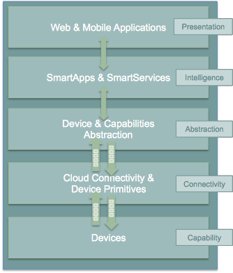
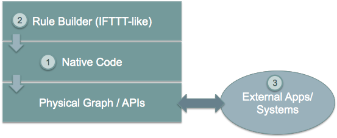

What is SmartThings?
====================

SmartThings is the platform for what we call the “Open Physical Graph”.
The Physical Graph is the virtual, online representation of the physical
world. And we believe that virtual representation should be open and
easily accessible to consumers, developers, and device
makers/manufacturers.

When you interact with the physical graph, it automatically reflects
that interaction in the physical world. And when you interact with
connected devices in the physical world, it automatically reflects that
interaction in the physical graph.

This is what will make the physical world programmable! And when we say
programmable, we don’t mean by firmware developers with highly
specialized skill sets. We mean programmable by anyone with a typical
web-developer skill set.

The first applications of the SmartThings technology are focused on
revolutionizing the Home Automation industry! Home Automation has been a
dream for decades with the idea of smart homes that would do lots of
things automatically, predict your needs, and even talk to you!

SmartThings is the first solution for Home Automation that is Easy,
Open, and Intelligent enough for broad consumer adoption. That means
that you can Do It Yourself (DIY) using the SmartThings platform without
the need for electricians or expert IT support.

In order to make this vision a reality, we realized early on that we
needed to provide an end-to-end solution of hardware, software, a
fantastic user experience, and incredible user support. To do that we
provide three different SmartThings “Kits” that include our SmartThings
Hub, Smart Devices, and are bundled with free SmartApps to make your
life better.

These initial SmartThings kits include:

-  Home Security - The SmartThings Home Security Solution contains
   everything you need to monitor comings and goings through your main
   doors, turn on a light in response to motion, and react differently
   to events if you or a loved one are home vs. away.
-  Home Watch - The SmartThings Home Watch Solution is designed to help
   identify potential problems in the home by knowing critical
   information about temperature, vibration, motion and moisture when
   you’re home or away.
-  Family Life - The SmartThings Family Life Solution helps keep track
   of the comings and goings of loved ones and pets, as well as keeping
   dangerous or special items monitored for access or motion.

But these kits and applications are just the starting point. Each
customers usage of the SmartThings platform will be as diverse and
varied as their lives are. And to support that diversity, we need a
diverse catalog of applications and devices! That is where you come in!

What We Believe
---------------

As a starting point in understanding our approach, it is important to
recognize that we believe strongly in the separation of “Intelligence”
from devices. We believe that the time has come when devices themselves
can be limited to their primitive capabilities (open/close, on/off,
heat/cool, brew/don’t brew), and that the intelligence layer should be
kept separate.

By doing this we allow the intelligence (or application) layer to apply
flexibly across a wide range of devices, and make it easier to create
applications that interact with and across the physical world. In many
cases, we also benefit from lower-cost end devices, less maintenance
complexity and longer battery life.

**A Phased Implementation of our Technology**

We made the decision at SmartThings to support a “Cloud First” approach
for our platform. This means that in our initial release, there is a
dependency on the Cloud. SmartApps run in the SmartThings Cloud, so for
everything to work, your hub does need to be online and connected to our
cloud. And this will generally be the case, even when we implement
hub-local capabilities as described below.

We believe in a “connected” service where local capabilities in the hub
are meant to improve performance and insulate the customer from
intermittent internet outages. We do not plan to support a perpetually
disconnected mode.

We made the decision to limit SmartApps to the Cloud in our first
release because it allowed us to focus more on the experience of writing
the applications and less on the mechanics of deploying that logic
locally to the hub.

That said, we are actively considering implementation scenarios whereby
we can distribute SmartApps to and execute SmartApps locally on the hub.

In all cases, we obviously recognize the critical scenarios where a loss
of communications with the SmartThings Cloud could have a degrading
impact on critical, local use cases and are being deeply thoughtful on
how we minimize the risk of disruption.

Our architecture is designed in a way that abstracts away from the
details of a specific device (Zigbee, ZWave, Wifi/IP/UPnP, etc) and
allows the developer to focus solely on the capabilities and actions
supported by the device (lock/unlock, on/off, etc).

That conceptual architecture looks like this:

   Conceptual Architecture
Applications, or SmartApps, sit on top of that abstraction layer and the
result is that SmartApps are easy to write, debug, and test in the
SmartThings Cloud.

**Why Not Just Run All SmartApps on the SmartThings Hub?**

Building for the Cloud first allowed us to focus on a more generalized
developer skill set for SmartApps (meaning not firmware development) and
get a robust solution to market more quickly. We thought that was
important because we don’t want SmartApps to be the exclusive domain of
firmware developers. We want the SmartApps community to be made up of
developers of all kinds, and we’ve put a lot of energy into reducing
friction for developers and makers. The Cloud-First approach allowed us
to move quickly, and now we can iteratively move capabilities into the
hub to support local SmartApps and reduce the dependency on the Cloud
where possible.

That said, there are a number of important scenarios where the Cloud is
simply required and where we can’t reduce or eliminate dependence on the
Cloud, so let's address each of those specifically:

-  **There may not be a Hub at all!** – We are currently witnessing an
   explosion of connected devices coming onto the market. This include
   lots of WiFi/IP connected devices from a variety of vendors
   (everything from plant sensors to garage door openers). The advantage
   of Wifi devices is that they can eliminate the need for a gateway
   device (hub) and connect directly to the cloud. We plan to support
   these types devices, both in a direct-to-cloud model and in a
   cloud-to-cloud model. When you consider the breadth of devices like
   this that are coming onto the market, it’s easy to imagine that there
   will be customers who want to be able to add intelligence to those
   devices through SmartApps, but that may not have a SmartThings Hub at
   all because all of their devices are directly connected to the vendor
   cloud or the SmartThings Cloud. Put simply, if there is no Hub, then
   the SmartApps layer must run in the cloud!
-  **SmartApps May Run Across both Cloud and Hub Connected Devices** –
   As a corollary to the first point above, since there are cases where
   devices are not hub-connected, SmartApps might be installed to use
   one device that is hub-connected, and another device that is
   cloud-connected, all in the same app. In this case, the SmartApp
   needs to run in the Cloud.
-  **There may be Multiple Hubs** – While the mesh network standards for
   Zigbee and Zwave generally eliminate the need for multiple
   SmartThings Hubs, we didn’t want to exclude this as a valid
   deployment configuration for large homes or even business
   applications of our technology. In the multi-hub case, SmartApps that
   use multiple devices that are split across hubs will run in the Cloud
   in order to simplify the complexity of application deployment.
-  **External Service Integration** – SmartApps may call external web
   services and calling them from our Cloud reduces risk because it
   allows us to easily monitor for errors and ensure the security and
   privacy of our customers. In some cases, the external web services
   might even use IP white-listing such that they simply can’t be called
   from the Hub running at a user’s home or place of business. So
   SmartApps that use web services will run in the Cloud as well.
-  **Third-Party Hub/Gateways** – We ultimately want to support
   third-party hubs/gateways/routers built to our interface
   specifications (for how to talk to our Cloud) that have a range of
   capabilities. Some may have the ability to run local SmartApps or
   Wiring, others may not, and we want to be able to handle the full
   range of scenarios here. That means that in some scenarios, local
   SmartApps or even Wiring simply may not be possible.

Lastly on this topic, keep in mind that because of the Abstraction
layer, SmartApps developers never have to understand where or how
devices connect to the SmartThings platform. All of that is hidden from
the developer, so that whether a device (such as a Garage Door opener)
is Hub-Connected or Cloud-Connected, all the developer has to understand
is:

::

    MyGarageDoor.Open()

And that is really important to our vision of keeping it as simple as
possible for developers, makers, and power users who want to write their
own SmartApps!

**Macro-Benefits to the SmartThings Approach**

At the end of the day, there are a number of important benefits to the
overall SmartThings approach, summarized here:

-  **Bringing Supercomputing Power to SmartApps and the Physical World**
   – No matter how much computing power we put into the SmartThings Hub,
   there are scenarios where it simply wouldn’t be enough. Take for
   example the ability to apply advanced facial recognition algorithms
   to a photo taken by our SmartThings Camera (stay tuned) to
   automatically determine who just walked into your house while you
   were away. In the Cloud we can bring all necessary computing power to
   bear to solve for just about any problem, but if we are limited to
   local processing power in a hub, there will always be limits.
-  **The Value of the Network Effect** – Our vision is to make your
   Physical World Smarter, and we are doing that not just for our Hub
   and Devices, but for lots of different devices and scenarios. The
   easier that we make it to create that intelligence (through
   SmartApps), the bigger that ecosystem of developers and makers will
   be. As a consumer that will mean the power of choice and the ability
   to solve real problems with a solution that most fits your unique
   needs. As a developer or maker it means broad access to consumers and
   distribution channels for your product.
-  **Increased Ease of Use, Accessibility, Reliability & Availability**
   - By centralizing many capabilities into the SmartThings Cloud, we
   increase our ability to monitor, manage, and respond to any failures
   or other issues. More importantly, we can simplify the customer
   experience and make our solution easier to use than ever before.
   Further, we ensure that customers have an increased level of access
   and visibility. This is not a new trend. There are lots of examples
   where on-premise capabilities have migrated to the service provider
   because it improved the overall service reliability and customer
   experience. From Voicemail to email and web hosting to doing your
   taxes, local capabilities turn into successful centralized services
   when there are additional customer benefits to doing so.

How Does It Work?
-----------------

The overall SmartThings solution has 4 logical architectural layers:

-  **End-Devices** - Which connect to the SmartThings Hub, or in some
   cases directly to the Cloud
-  **SmartThings Hub** - Which acts as a gateway for getting events &
   messages to/from the Cloud
-  **SmartThings Cloud** - Which provides the abstraction and
   intelligence layers described above, as well as the Web Services that
   support the presentation layer.
-  **User Experience** - Which provides the presentation layer for
   SmartThings in the form of mobile applications and our Web IDE

Within the SmartThings Cloud however there are also four logical
“layers” of the architecture as well:

-  **Connectivity** - Which is responsible for maintaining persistent
   connectivity to SmartThings Hubs and the SmartThings Mobile
   application
-  **Event Processing & Routing** - This layer routes events from
   hubs/devices to SmartApps that are subscribed to specific
   devices/events.
-  **Application** - This layer provides the Data Access Layer for data
   about accounts, users, and devices and is responsible for the
   execution of SmartApps.
-  **Web Services** - This layer provides the web services or
   Application Programmatic Interface (API) layer that supports both the
   mobile applications as well as developers who want to integrate from
   an external system using the SmartThings APIs

What Protocols Does It Support?
-------------------------------

We wanted to support as many off-the-shelf devices out-of-the-box as
possible. So we chose to support the following protocols in the
SmartThings Hub:

-  Zigbee - A Personal Area Mesh Networking standard for connecting and
   controlling devices. Zigbee is an open standard supported by the
   Zigbee Alliance. For more information on Zigbee see
   http://en.wikipedia.org/wiki/ZigBee.
-  Z-Wave - A proprietary wireless protocol for Home Automation and
   Lighting Control. For more information on Z-Wave see
   http://en.wikipedia.org/wiki/Z-Wave.
-  IP-Connected Devices - Though this is not yet available, we are
   working to support IP-connected (typically WiFi) devices. This will
   also include support for various industry standards within the IP
   umbrella such as UPnP and REST.
-  Cloud-Connected Devices - Some device manufacturers have their own
   Cloud solutions that support their devices and want us to connect to
   them - so we will!

Ways to Build Applications & Services Using the SmartThings Platform
--------------------------------------------------------------------

SmartThings plans to support three different ways of building
applications and services using the SmartThings platform. These are: +
On-Platform Applications - SmartApps written in a supported Native
programming language. These applications are compiled to byte-code and
run natively on the SmartThings platform + Rule-Builder Applications -
SmartApps written in a Graphical rule builder. These GUI-generated rules
are converted into the native programming language and then compiled to
byte-code like any other SmartApp (NOTE: Rule-Builder Application
support is under development and not yet available) + External Apps or
Services - External Systems or Services that integrate with the
SmartThings platform using APIs, allowing anyone to write any
application or service they want and operate it themselves

   Building
➞ <smart-things-architecture.md>`__
