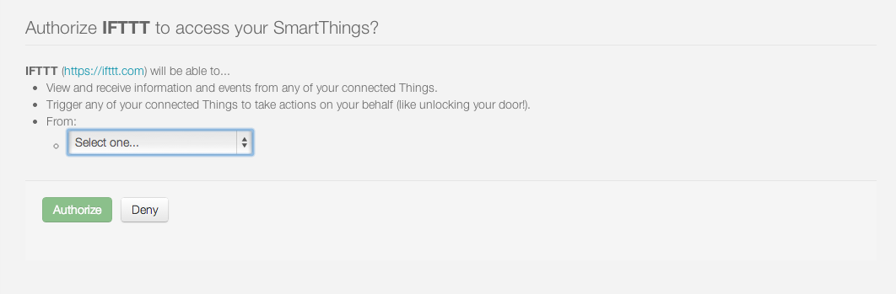
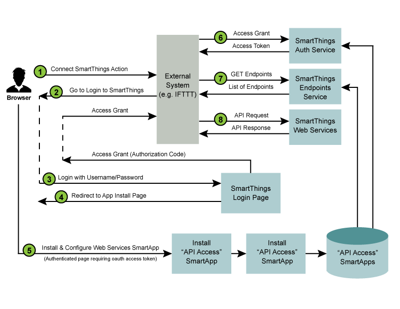

SmartThings Web Services Overview
=================================

*Integrating with SmartThings using SmartApps Web Services*

Overview
--------

**Introduction**

Our goal is to become THE open platform for the consumer Internet of Things. But that doesn’t 
mean that we can ignore security, even for a minute. So when we started thinking about how to 
allow external API access, we wanted to give developers the flexibility they needed, but also 
ensure that the customer understands when their account is being accessed through an 
external API and has specifically authorized that access.

As such, we’ve designed an architecture and a user experience around External API access that 
meets the following goals:

-  It uses industry best practices such as OAuth2 to authenticate and authorize basic 
   external API access
-  It requires the end­user (customer) to specifically authorize the access to
   specific devices
-  It delivers a user experience that is easy to understand
-  It delivers a developer experience that is easy to understand and implement

**Concepts**

There are a couple of important concepts that need to be understood with respect to how 
SmartApps APIs work.

First, all SmartApps APIs are authenticated using OAuth2 as our authentication mechanism. 
That means that each SmartApp that provides web services is given an OAuth client id and 
client secret that are used in the OAuth2 process.

Second, when we talk about SmartApps APIs, we are actually talking about APIs that are 
exposed by SmartApps themselves. That means that any SmartThings developer can write a 
SmartApp that exposes its own APIs. We call this a Web Services SmartApp.

Third, remember that SmartApps run in a special security context where they only have access 
to devices that are specifically authorized by the user at SmartApp installation time. We’ve 
chosen to take advantage of that and create a mechanism that allows for the creation of custom 
web services but preserves all of our security mechanisms and boundaries.

**How it Works**

Our overall approach to API access requires the end­user to
authenticate and authorize the API access in two steps:

-  The installation of a SmartThings Web Services “SmartApp” into the user’s SmartThings 
   Account/Location along with specific device preferences that specify the devices to 
   which the external system is being granted access
-  The typical OAuth login flow that grants the external system the OAuth Access Token

It is important to understand that it is the SmartApp itself that exposes the API endpoints that are 
then used by the external system to integrate with SmartThings.

This approach is designed to ensure that an external system must have explicit access granted 
to the devices before it can control those devices, and that the OAuth access token isn’t 
enough to grant access to the user’s entire physical graph.

**OAuth-Integrated App Installation** |Alt OAuth-Integrated App
Installation| The diagram above outlines the following standard steps in
the API Connection and Usage process:

1. A user of the external system takes some action that initiates a “Connect to 
   SmartThings” flow. An example of this would be an \ `IFTTT <http://www.ifttt.com>`__
   user   adding the SmartThings “Channel”.
2. The external service will typically redirect to the SmartThings login 
   page. The HTTP request to this page includes the required OAuth client id (more details below),
    allowing our login page to recognize this as a login request in 
   support of an ultimate OAuth connection.
3. The login page is displayed, and if the login is successful, then a subsequent page is 
   displayed that allows the now-authenticated user to install and configure the Web 
   Services SmartApp that is associated with the original client id. When this 
   step is complete, an Authorization Code is returned to the browser.
4. Typically the Authorization
   Code is then given to the external system, and that external 
   system uses it, along with the OAuth client id and client
   secret, to request an access token. The Authorization
   Code takes the place of the user credentials in this case and is only valid 
   for a single use. Once the external system has the OAuth2 access token, API requests can be made using this token.
5. The first API call that the external system should make is to the end­points service. This 
   service exists on a standard URL, and will return the specific URL that the external 
   system should use (for this specific OAuth2 access
   token) to make all API requests.
6. Finally, the external system can use the specified endpoint URL and the provided 
   OAuth2 Access Token in order to make API calls to the SmartApp that is providing the 
   web services.

The End-User Journey
--------------------

Before we show you more about building the “Web Services” SmartApp, let’s give you an 
understanding of what the customer will experience.

**Initiate Connection from External System**

The first step is to initiate the connection to the SmartThings Cloud from within the external web 
application. This is different for each web application, but is
basically a link.

**Authentication & Authorization**

The typical OAuth journey is the OAuth2 Authorization Code flow, initiated from the web­site of the 
external system, whereby the user is redirected to the SmartThings web­site, where they enter their SmartThings credentials as shown below:

.. figure:: ../img/smartapps/web-services/oauth-login.png
   :alt: Alt OAuth Login

   Alt OAuth Login
After the user enters their SmartThings credentials and successfully authenticates to SmartThings, they will be prompted to specifically authorize access by your application.

**Application Configuration**

The user is prompted to configure the Web Services SmartApp that will be automatically installed. The user does not have to select the specific SmartApp because it can automatically be identified based on the OAuth client id.

The first step in the application configuration process is to identify the Location in which the SmartApp will be installed.

   Alt Location
The second step is to configure exactly which devices will be accessible
through any external web services that are exposed by the SmartApp.

An example of the IFTTT SmartApp device selection options is shown
below:

.. figure:: ../img/smartapps/web-services/preferences.png
   :alt: Alt Preferences

   Alt Preferences
Finally, the user clicks on “Authorize” to complete both the
authorization of the application and the installation of the SmartApp
and the connection between the external system and the SmartThings Cloud
is now complete.

Once the user authorizes access, the external system is provided with
the OAuth authorization code, which is in turn used to request and
receive an OAuth access token. Once the
external system has the token, it can access the Web Services provided by the SmartApp.

